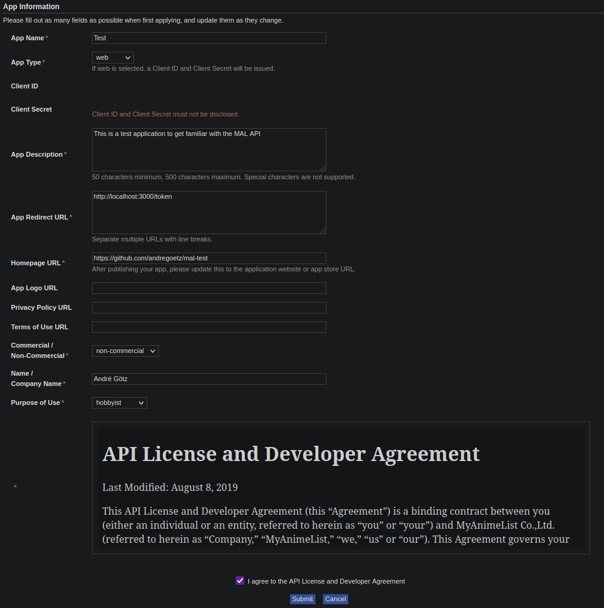

# How to use the MAL-API

## Important Links

[Api Introduction at MAL](https://myanimelist.net/apiconfig)  
[Authorization Documentation](https://myanimelist.net/apiconfig/references/authorization)  
[Api Reference](https://myanimelist.net/apiconfig/references/api/v2)

[Good Explanation on MAL Blog](https://myanimelist.net/blog.php?eid=835707)  
[API Forum in MAL](https://myanimelist.net/forum/?clubid=13727)

## 1. Create ID / Application [Link](https://myanimelist.net/apiconfig/create)

## 2. Generate Access Token

* Run the [NodeJS-App](mal/)
  * **IMPORTANT:** Copy the Code Challenge at Step 1
  * Paste the Code Challenge from Step 1 at Step 2
